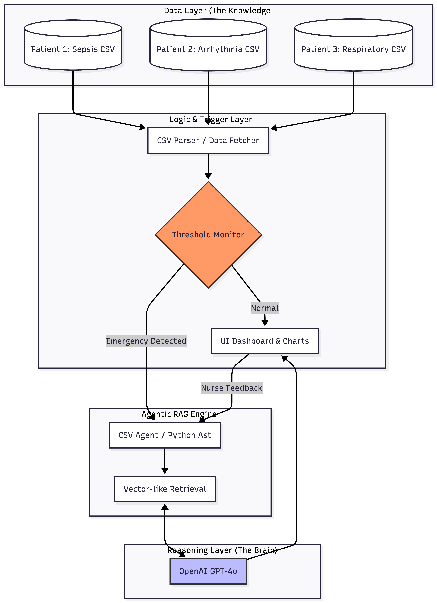

# 🏥 AI-Based Patient Monitor (Agentic RAG Application)

This repository contains a Streamlit-based ICU Patient Monitoring application that utilizes **Retrieval-Augmented Generation (RAG)** and **Agentic Reasoning** to provide clinical decision support.

## 🚀 Overview
The application monitors minute-by-minute physiological data for ICU patients. When critical thresholds are breached, an AI Agent automatically analyzes the patient's historical trends to provide a diagnosis and suggest immediate life-saving interventions.

### Key Features
* **Real-time Monitoring:** Visualizes Heartbeat, SpO2, Temperature, and Blood Pressure.
* **Emergency Alerts:** Visual flashing alarms and audio cues for critical vital signs.
* **Agentic RAG Engine:** Uses a LangChain CSV Agent to query historical data and reason over clinical trends.
* **AI Observability:** Displays telemetry data including model latency and token usage.

## 🛠️ Architecture
The system follows a modular AI architecture:
1.  **Data Layer:** Synthetic ICU vitals stored in CSV format (Sepsis, Arrhythmia, and Respiratory Failure scenarios).
2.  **Detection Layer:** Python logic monitors real-time thresholds.
3.  **Reasoning Layer:** OpenAI GPT-4o via LangChain interprets trends to suggest medical protocols.
4.  **UI Layer:** Streamlit dashboard for clinical visualization.



## 📋 Prerequisites
* Python 3.10+
* OpenAI API Key

## ⚙️ Installation & Setup

1. **Clone the repository:**
   ```bash
   git clone <your-repo-link>
   cd <repo-folder>

2. Create and activate a virtual environment:
   ```bash 
   python -m venv .venv
   source .venv/bin/activate  # On Windows use `.venv\Scripts\activate`

3. Install dependencies:
   ```bash 
   pip install -r requirements.txt

4. Configure Environment Variables:
   * Create a .env file in the root directory and add your OpenAI API Key:
   ```bash 
   OPENAI_API_KEY=your_sk_key_here

## 🏃 Running the Application
   ```bash 
   streamlit run patient_monitor.py
```
## 🧪 Simulated Scenarios
* Patient 1 (Sepsis): Presents with rising temperature and dropping blood pressure.
* Patient 2 (Arrhythmia): Simulates a sudden V-Tach episode with extreme tachycardia.
* Patient 3 (Respiratory Failure): Shows a progressive decline in oxygen saturation (SpO2).

## 📊 AI Observability (Telemetry)
The application tracks the following metrics for every agentic reasoning call:

 * Model: GPT-4o
 * Avg Latency: 2.5s - 4.0s
 * Avg Token Usage: ~500 tokens per analysis